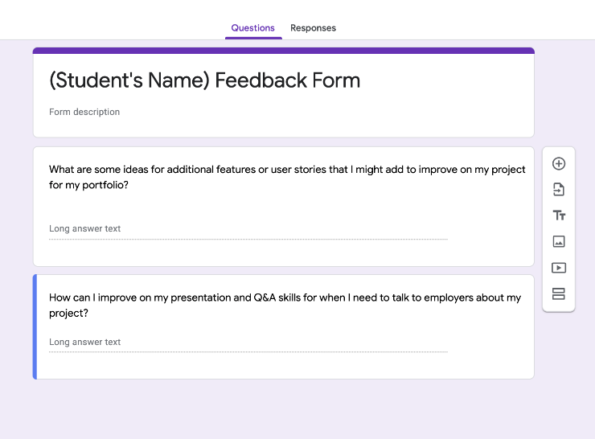

# Presentation Process

[project slides](https://docs.google.com/presentation/d/1ftFaNsY7eJqVJ-3pzkSrpINHcXllKNMC6uq9SsWUDM8/edit#slide=id.geba780a0c3_0_0)

## General Guidelines
- Keep your presentation length down to about three to five minutes
- I wouldn't be mad if you dressed up a little
- Treat it as practice for interviews

## Presentation Content
1. Pull up the landing page
2. Tell us your name and project title
3. Post the link to your feedback survey
4. Tell us why you built this project
5. What tech stacks did you use and why
6. What extra tech did you use and why
7. Demo the project - give us a short tour of each page/feature
8. Take a couple of questions

## Feedback Forms
Create a peer feedback survey using Google Forms to distribute to your peers in the chat before you present! This is your opportunity to gain perspective into your own work and presentation. You may use the example below as your form if you choose. One or two questions is ideal, and at most three, since people will be filling these out during presentations.

To make a google form, go to [forms.google.com](https://www.google.com/forms/about/). If you do not have a google account, you can also make one with a Microsoft/Outlook account at [forms.microsoft.com](https://forms.office.com/).

