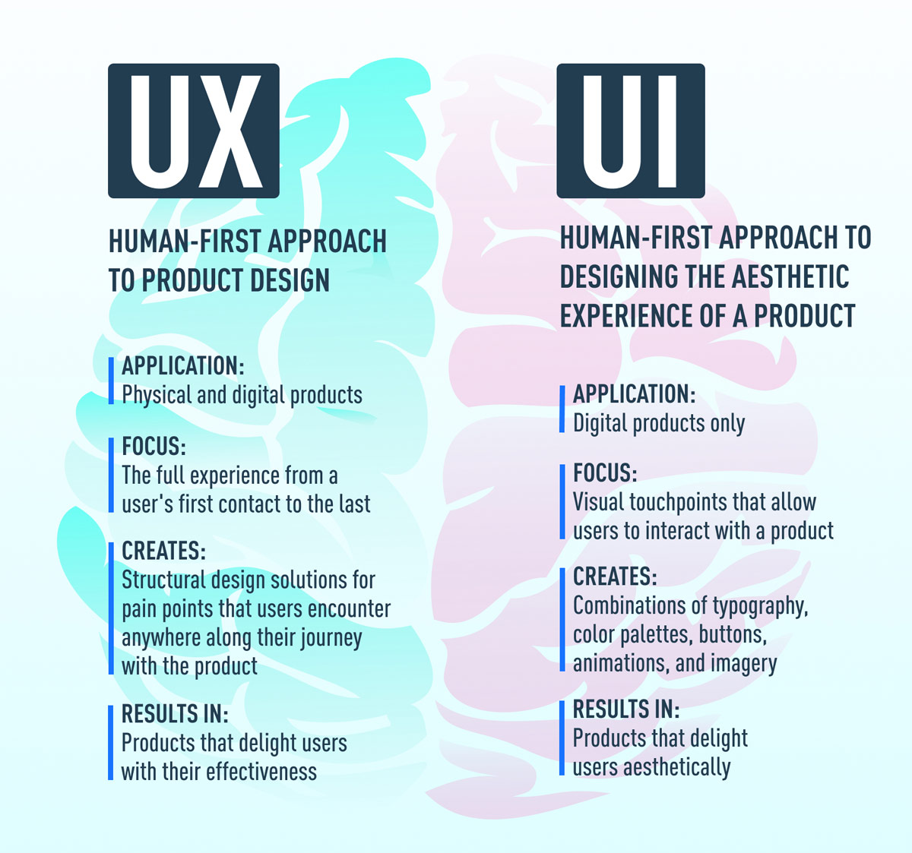

# UX/UI
At the most basic level, UI is made up of all the elements that enable someone to interact with a product or service. UX, on the other hand, is what the individual interacting with that product or service takes away from the entire experience.

## UI Design
UI (User Interface) design is the process of creating the look and feel of an application's user interface. The user interface (UI) encompasses both the appearance and interactivity of an app.

**The 5 Principles of Design**
1. Balance
2. Alignment
3. Proximity
4. Repetition
5. Contrast

## UX design
UX (User Experience) Design is the process of creating products and services that solve a specific user problem, while ensuring that the proposed solution is both easy and enjoyable to use.

**7 Fundamental Principles of UX Design**
1. User-centricity
2. Consistency
3. Hierarchy
4. Context
5. User control
6. Accessibility
7. Usability

#### Laws of Design

#### UI is the bridge that gets us where we want to go, UX is the feeling we get when we arrive.

More reading:
- [The Difference Between UX and UI Design – A Beginner’s Guide](https://careerfoundry.com/en/blog/ux-design/the-difference-between-ux-and-ui-design-a-laymans-guide/)
- [The 5 Basic Principles of Graphic Design & Their Importance](https://blog.shillingtoneducation.com/graphic-design-basic-principles/)
- [7 fundamental UX design principles all designers should know](https://www.uxdesigninstitute.com/blog/ux-design-principles/)